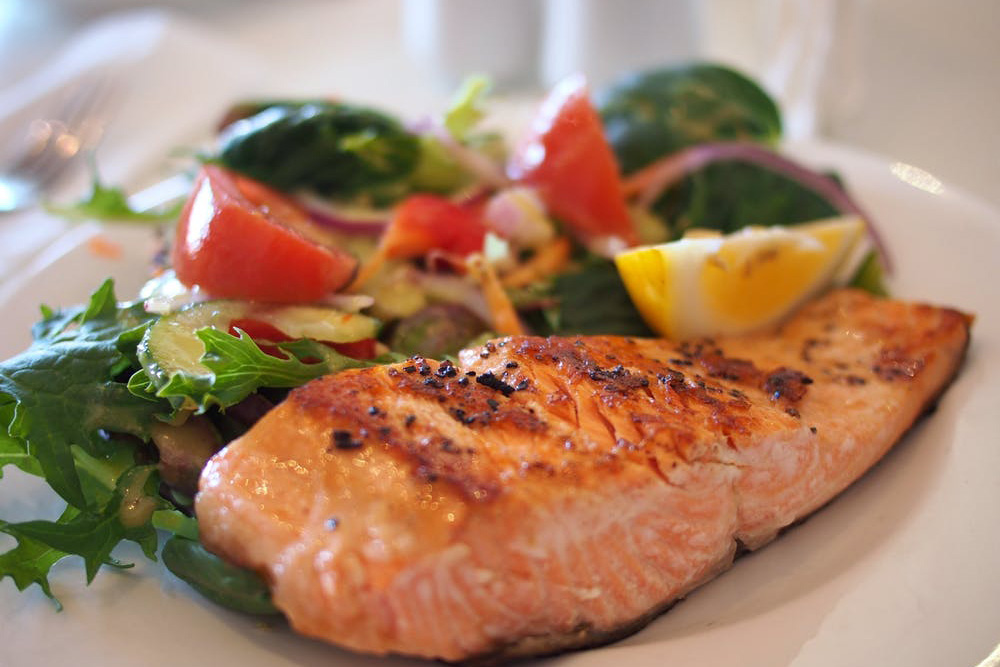
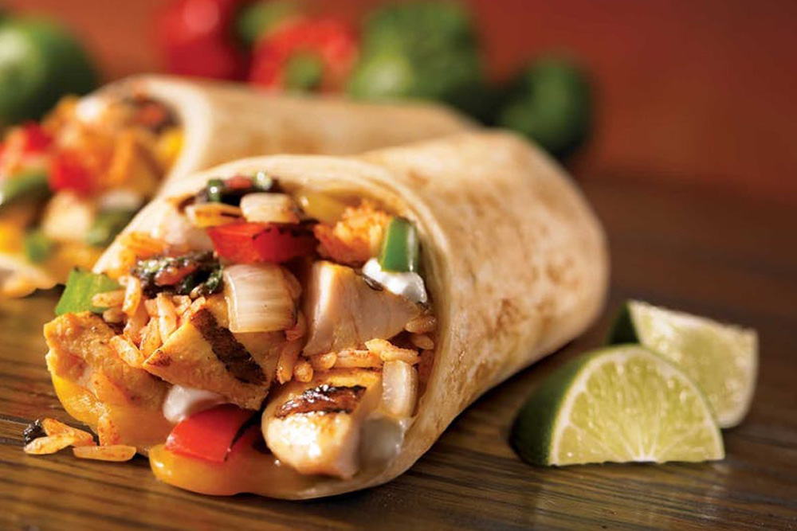
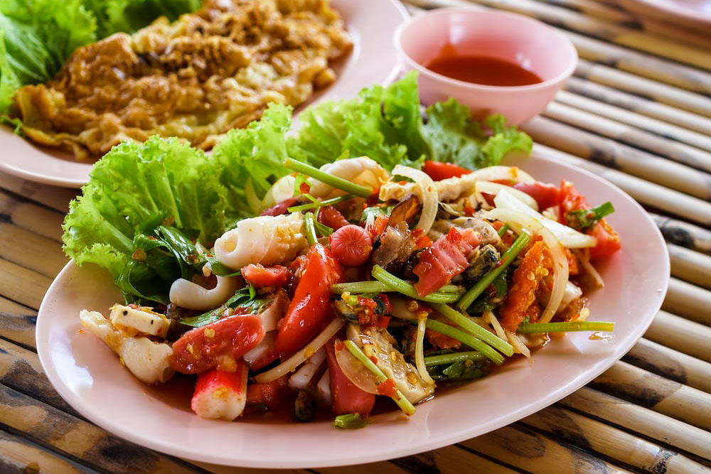
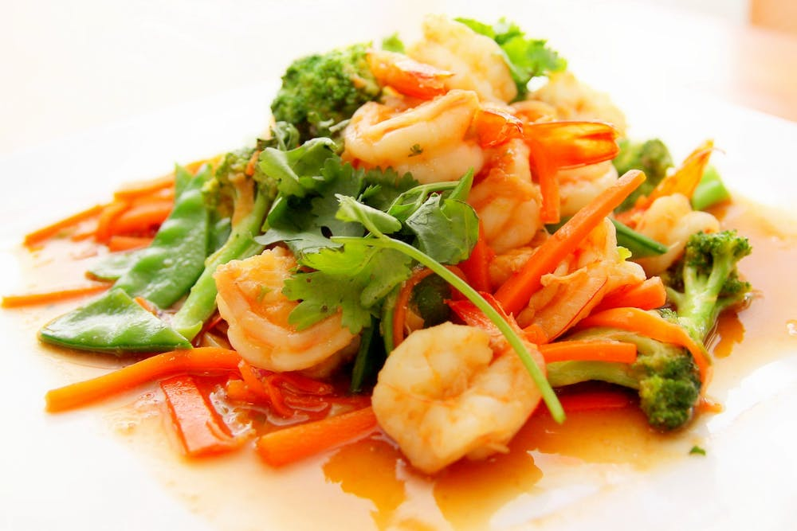
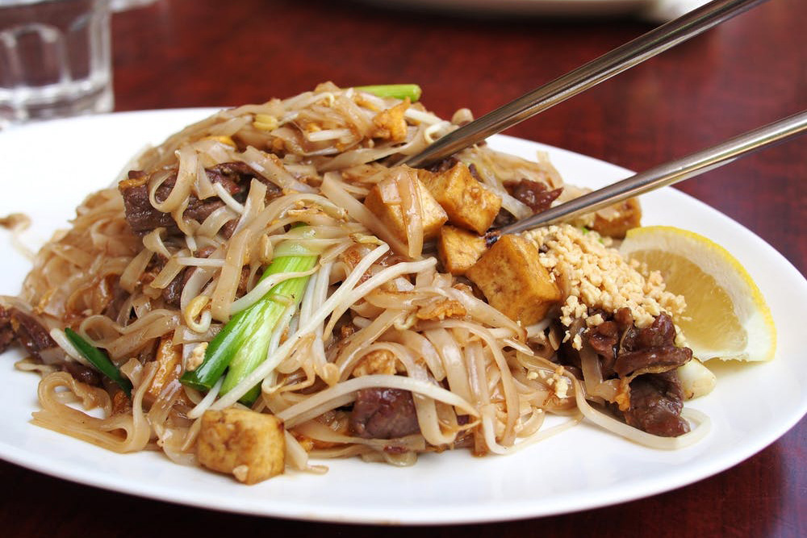
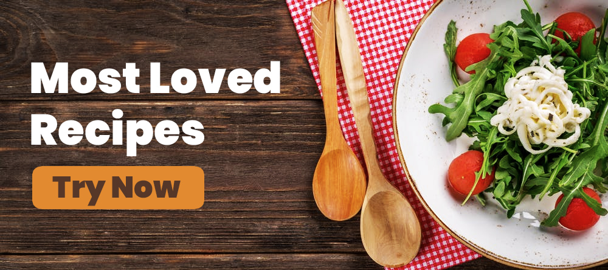
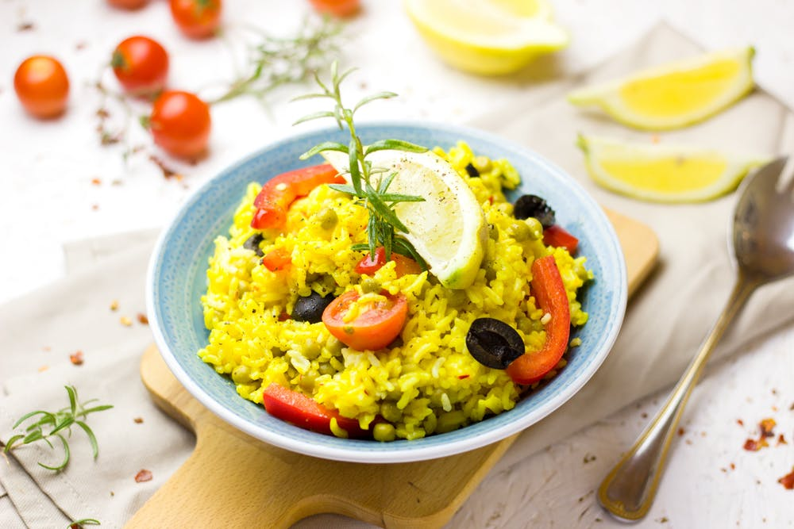
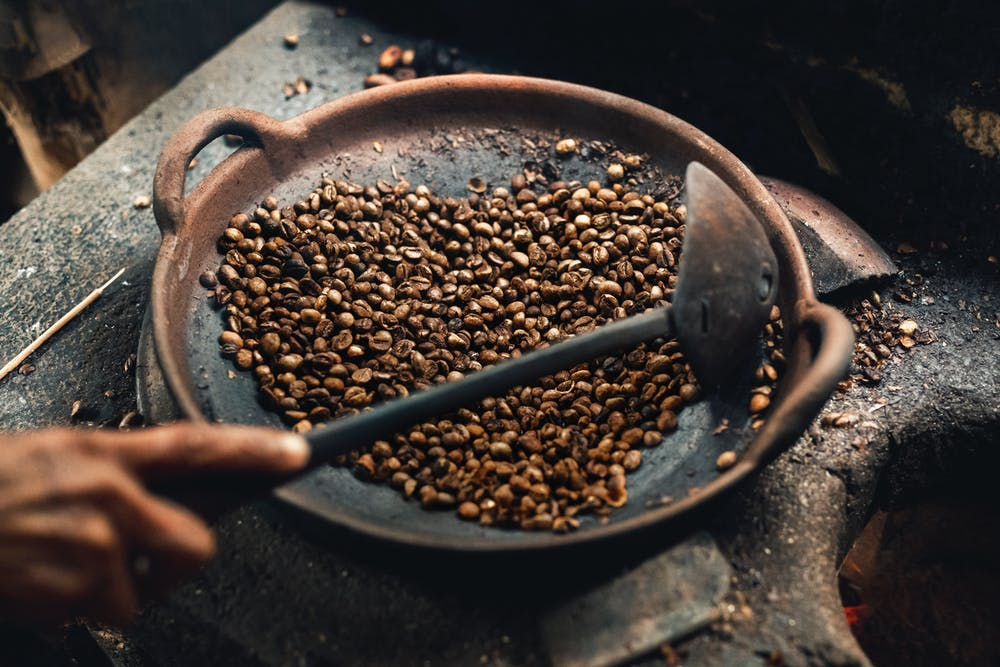

<!doctype html>
<html lang="en">

<!-- Mirrored from resptheme.com/tf/foodkuy/_preview/green-leaf/homepage.html by HTTrack Website Copier/3.x [XR&CO'2014], Sun, 26 Jan 2020 19:51:28 GMT -->
<head>
<!-- Required meta tags -->
<meta charset="utf-8">
<title>Foodkuy - Mobile HTML Template</title>
<meta name="viewport" content="width=device-width, initial-scale=1, shrink-to-fit=no">
<meta name="mobile-web-app-capable" content="yes">
<meta name="apple-mobile-web-app-capable" content="yes">
<meta name="apple-touch-fullscreen" content="yes">
<meta name="HandheldFriendly" content="True">
<link rel="icon" href="favicon.html" type="image/x-icon">

<!-- Bootstrap v4.3.1 CSS -->
<link rel="stylesheet" href="lib/bootstrap/css/bootstrap.min.css">
<!-- Custom CSS -->
<link rel="stylesheet" href="css/normalize.css">
<link rel="stylesheet" href="css/theme.css">
<link rel="stylesheet" href="css/theme/themelibrary.css">
<!-- Slick CSS -->
<link rel="stylesheet" type="text/css" href="lib/slick/slick/slick.css">
<link rel="stylesheet" type="text/css" href="lib/slick/slick/slick-theme.css">
<!-- Magnific Popup core CSS file -->
<link rel="stylesheet" href="lib/Magnific-Popup-master/dist/magnific-popup.html">
<!-- Font Awesome Free 5.10.2 JS -->

</head>
<body class="default">

<!-- Preloading -->

  

    

  

<!-- .Preloading -->

  <!-- Sidebar left -->
  <nav id="sidebarleft" class="sidenav">
  

    <i class="fas fa-times"></i>
  

  

    <h3>Menu</h3>
  

  

    

      
    

    

      
Sarah Corner

      
Exclusive Author

    

  

  <ul class="list-unstyled components">
    <li>
      <a href="homepage.html"><i class="fas fa-home"></i> Home</a>
    </li>
    <li>
      <a href="#pagemyaccount" data-toggle="collapse" aria-expanded="false"><i class="fas fa-user"></i> My Account <i class="fas fa-caret-down"></i></a>
      <ul class="collapse collapsible-body" id="pagemyaccount">
        <li>
          <a href="new_recipe.html">Add new recipe</a>
        </li>
        <li>
          <a href="profile.html">Profile</a>
        </li>

        <li>
          <a href="setting.html">Setting</a>
        </li>
      </ul>
    </li>
    <li>
      <a href="#pagesubmenu" data-toggle="collapse" aria-expanded="false"><i class="fas fa-clone"></i> Pages <i class="fas fa-caret-down"></i></a>
      <ul class="collapse collapsible-body" id="pagesubmenu">
        <li>
          <a href="homepage.html">Home</a>
        </li>
        <li>
          <a href="recipe_list.html">Recipe list</a>
        </li>
        <li>
          <a href="recipe_page.html">Recipe page</a>
        </li> 
        <li>
          <a href="author.html">Author</a>
        </li>
        <li>
          <a href="feedback.html">Feedback</a>
        </li>
        <li>
          <a href="setting.html">Setting</a>
        </li>
        <li>
          <a href="gallery.html">Gallery</a>
        </li>
         <li>
          <a href="news_list.html">News list</a>
        </li>
        <li>
          <a href="news.html">News</a>
        </li>
        <li>
          <a href="register.html">Register</a>
        </li>
        <li>
          <a href="login.html">Login</a>
        </li>
        <li>
          <a href="new_recipe.html">New recipe</a>
        </li>
        <li>
          <a href="profile.html">Profile</a>
        </li>
        <li>
          <a href="favorite.html">Favorites</a>
        </li>
        <li>
          <a href="single_page.html">Single page</a>
        </li>
        <li>
          <a href="404.html">404 error page</a>
        </li>
      </ul>
    </li>
    <li>
      <a href="favorite.html"><i class="fas fa-heart"></i> Favorites</a>
    </li>
    <li>
      <a href="#"><i class="fas fa-star"></i> Rate</a>
    </li>
    <li>
      <a href="feedback.html"><i class="fas fa-envelope"></i> Feedback</a>
    </li>
    <li>
      <a href="setting.html"><i class="fas fa-cog"></i> Settings</a>
    </li>
    <li>
      <a href="single_page.html"><i class="fas fa-exclamation-circle"></i> About</a>
    </li>
  </ul>
  </nav>
  <!-- .Sidebar left -->
  <!-- Sidebar right -->
  <!-- Sidebar right -->
  <!-- Page content  -->
  

    <!-- Header  -->
    <nav class="navbar navbar-expand-lg navbar-light bg-header">
    

      <button type="button" id="sidebarleftbutton" class="btn">
      <i class="fas fa-align-left"></i>
      </button>
      
Foodkuy

    

    </nav>
    <!-- .Header  -->
    <!-- Content Wrap  -->
    

      

        

          
        

        

          
        
 
      

      

        

          
Recipes You Might Like...

          

        

        

          

            

              
            

            
Chicken Fried Steak

          

          

            

              
            

            
Grilled Fish Tacos

          

          

            

              
            

            
Steak with Garlic

          

          

            

              
            

            
Harvest Salad

          

          

            

              
            

            
Cheesy Pizza

          

          

            

              
            

            
Teriyaki Chicken

          

        

      

      

        

          
Popular Categories

          

        

        

          

            

              
Quick and Easy

            

            

              
            

          

          

            

              
Dinner Ideas

            

            

              
            

          

          

            

              
Healthy

            

            

              
            

          

          

            

              
Vegetarian

            

            

              
            

          

          

            

              
Cakes and Baking

            

            

              
            

          

          

            

              
World Cuisine

            

            

              
            

          

          

            

              
Meal Type

            

            

              
            

          

          

            

              
Chicken Recipes

            

            

              
            

          

          

          

            
See More

          

        

      

      

        
      
 
      

        

         
News & Tips
 
          

        

        

          

            

              

                
              

              

                
15 Totally Healthy Grilling Recipes

                

                  Lorem ipsum dolor sit amet, adipiscing elit... <a href="news.html" class="more">Read More</a>
                

              

            

          

          

            

              

                
              

              

                
Foods That Are Super Healthy

                

                  dolor sit amet, Lorem ipsum adipiscing elit... <a href="news.html" class="more">Read More</a>
                

              

            

          

          

            

              

                
              

              

                
17 Authentic local food in Yogyakarta

                

                  Lorem ipsum dolor adipiscing elit... <a href="news.html" class="more">Read More</a>
                

              

            

          

          

            <a href="news_list.html">
More News
</a> 
          

        

      

      

        

          
Top Author

          

        

        

          

            

              
            

            
Amanda

          

          

            

              
            

            
Nicola

          

          

            

              
            

            
Sally

          

          

            

              
            

            
Connor

          

          

            

              
            

            
Olivia

          

          

            

              
            

            
Peter

          

          

            

              
            

            
Walker

          

        

      

      <!-- SUBSCRIBE -->

  

    

      

        
SUBSCRIBE

        
Get news and food recipes every day

        

          <form name="subsribe">
          <input class="form-control" name="user-email" placeholder="Enter email address" value="" type="email">
          <button type="submit" class="submitsub"> <i class="fa fa-angle-right"></i></button>
        </form>
        

      

    

  

  

    
  

<!-- END SUBSCRIBE -->

    

    <!-- .Content wrap  -->
    <!-- Footer  -->
    

      
Follow Us

      

    
       
        

          <a href="#" class="si-icon"> <i class="fab fa-facebook-f"></i></a>
        

      

    

        

          <a href="#" class="si-icon"><i class="fab fa-instagram"></i></a>
        

      

    

        

          <a href="#" class="si-icon"><i class="fab fa-twitter"></i></a>
        

      

    

        

          <a href="#" class="si-icon"><i class="fab fa-youtube"></i></a>
        

      

      

    

    <!-- .Footer  -->
  

  <!-- .Page content  -->
  

  <!-- Optional JavaScript -->
  <!-- jQuery v3.4.1 -->
  
  <!--  Bootstrap v4.3.1 JS -->
  
  <!-- Magnific Popup core JS file -->
  
  <!-- Slick JS -->
  
  <!--  Custom JS -->
  

</body>

<!-- Mirrored from resptheme.com/tf/foodkuy/_preview/green-leaf/homepage.html by HTTrack Website Copier/3.x [XR&CO'2014], Sun, 26 Jan 2020 19:54:06 GMT -->
</html>